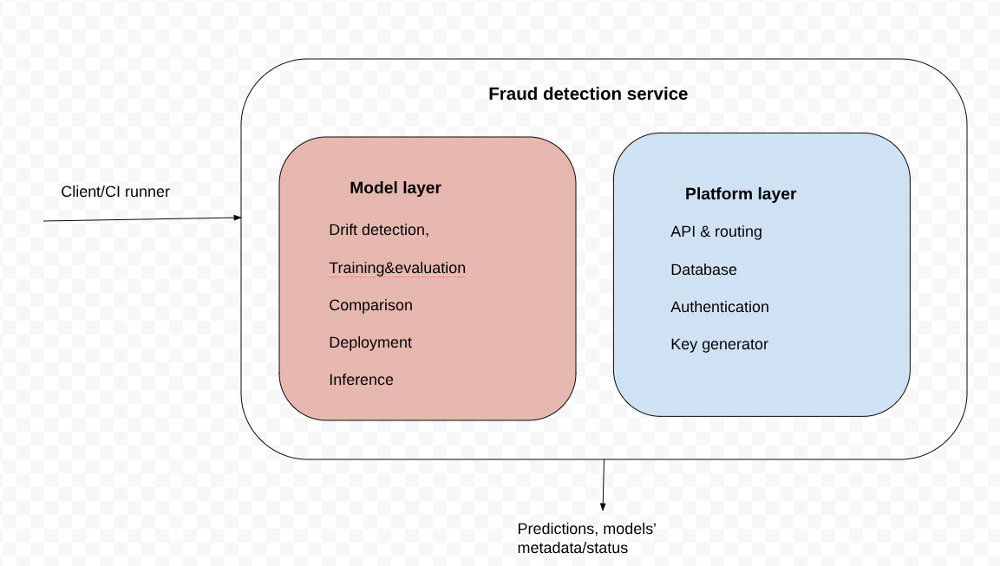
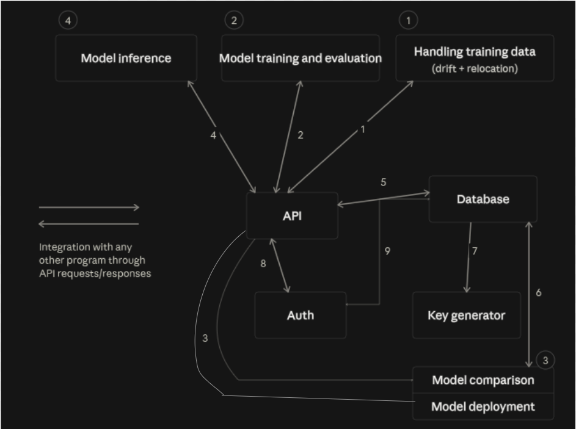

# Project: From Model to Production — Adaptive Fraud Detection System as a Service

A fraud detection system with seamless integration via API requests/responses, plus automated monitoring, retraining, evaluation, and deployment of the underlying ML model (XGBoost).

**XGBoost** — gradient-boosted trees for tabular classification. Gradient-boosted trees (GBT) are an ensemble method that builds many small decision trees sequentially, where each new tree focuses on correcting the errors made by the ones before it.

---

## Table of Contents

- [Overview](#overview)
- [Data Preparation](#data-preparation)
- [What You Can Do](#what-you-can-do)
- [Main Workflows](#main-workflows)
- [Automated Workflow in Detail](#automated-workflow-in-detail)
- [Setup Instructions](#setup-instructions)
- [API Reference](#api-reference)
- [Architecture Overview](#architecture-overview)

---

## Overview

This system exposes a fraud-detection ML model as a service. It supports two modes of operation:

1. **Manual, via direct API requests** — train, deploy, predict, and monitor on demand.
2. **Automated, via GitHub Actions** — a scheduled/triggered workflow that detects data drift, retrains the model, evaluates it, and deploys it if it's an improvement.

## Data Preparation

Before using the system, your data must meet these requirements:

- All features must be **numerical**.
- Data should preferably be **cleaned of duplicates**.
- **No need** to scale/normalize features, impute missing values, or handle outliers — the model handles this natively.
- Before running inference, ensure your data contains the **same columns/features** as the dataset the model was trained on.

You'll also need **access keys** to use the system (see [Setup Instructions](#setup-instructions)).

## What You Can Do

### 1. Direct API requests

- **(Re)train and (re)deploy** the model manually.
- **Make predictions** — after a model has been trained and deployed, submit transaction features (as a CSV file) and receive fraud probabilities for each transaction.
- **Monitor model performance** — view model metadata and the full history of deployed models.

### 2. Automated workflow (GitHub Actions)

Detects data drift, retrains the model, and redeploys it if the new model outperforms the current one (or if no model is currently deployed).

The workflow:
1. Pulls new training data from `data/incoming`.
2. Checks for data drift (or checks whether `data/production` is empty).
3. If drift is detected (or no production data exists), retrains the model.
4. Evaluates the new model and compares it against the currently deployed model.
5. Deploys the new model if it performs better — or if no model is currently deployed.

## Main Workflows

```
External application → API → Model → Prediction
External application → API → Database → Model information
GitHub Actions + new data → Drift detection → Training & comparison → Deployment → Model usage
```

## Automated Workflow in Detail

```
Wait for API → Detect data drift → [if drift detected] → Train & compare → [if new model is better,
                                                                              or none is deployed] → Deploy
```

At each step, the GitHub Actions runner sends API requests to the system running in a Docker container, and proceeds to the next step (or finishes) based on the API's response.

---

## Setup Instructions

### Prerequisites

- Git (+ a GitHub account)
- Docker and Docker Compose
- Python 3

### 1. Install and register a GitHub Actions runner locally

Installation steps vary by OS (tested on Linux Ubuntu). After installing, register the runner to your repository and start it:

```bash
./config.sh --url https://github.com/your-repository --token <YOUR_TOKEN>
./run.sh
```

> Get `<YOUR_TOKEN>` from your repo's **Settings → Actions → Runners → New self-hosted runner**.

### 2. Clone the repository

```bash
git clone https://github.com/Maria-0113/Project-From-Model-to-Production
```

### 3. Install dependencies

Create and activate a virtual environment:

```bash
python3 -m venv venv
source venv/bin/activate
```

Then, from the project root (where `requirements.txt` is located), run:

```bash
pip install -r requirements.txt
```

### 4. (Optional) Run tests

```bash
pytest -v
```

### 5. Start the containers

In **both** folders containing a `docker-compose` file — `database` and `src` — run:

```bash
docker compose up -d --build
```

> Tip: start the `database` service first.

### 6. Generate an API key

From the `src` folder:

```bash
docker compose exec app python3 -m keys.issue_key
```

This prints an API key to the terminal — copy it; you'll need it in the next step.

### 7. Add the API key to GitHub Secrets

In your GitHub repository, go to **Settings → Secrets and variables → Actions**, and add a new secret named `API_KEY` (this name must match the one used in the workflow YAML) with the key from Step 6.

### 8. Add data and run the workflow

Download the sample data from [Google Drive](https://drive.google.com/drive/folders/1SwG7yBBgzLzg9VxNnYKZ03X3D5IU5cbV?usp=sharing).

Create the following folders under `data/` and place one file in each:

- `my_project/data/production` — the existing/production dataset (e.g., `cleaned_data.csv`)
- `my_project/data/incoming` — new data to be processed by the workflow (e.g., `month_1.csv`)

Then run the workflow from the **Actions** tab.

> To simulate new data arriving after the workflow finishes, add a new file to the `incoming` folder and re-run the workflow.

### 9. Make API requests

See the [API Reference](#api-reference) below for available endpoints and example `curl` commands.

---

## API Reference

All requests require the `X-API-Key` header with your API key.

### Predictions

**Generate sample data for predictions**

From the `src` directory:

```bash
python3 sample_data.py
```

This creates two files:
- `sample_for_prediction.csv` — use this to request predictions
- `sample_with_labels.csv` — use this to check prediction correctness.

**Make a prediction**

```bash
curl -X POST \
  -H "X-API-Key: <your-api-key>" \
  -F "file=@sample_for_prediction.csv" \
  http://localhost:8000/predictions
```

**Get all predictions ever made**

```bash
curl \
  -H "X-API-Key: <your-api-key>" \
  http://localhost:8000/predictions/export
```

**Get all predictions made by a specific model**

```bash
curl \
  -H "X-API-Key: <your-api-key>" \
  http://localhost:8000/predictions/export/<model_id>
```

### Models

**Train a new model**

```bash
curl -X POST \
  -H "X-API-Key: <your-api-key>" \
  http://localhost:8000/models
```

> Returns a `model_id` — save it for later use.

**Get metadata for all trained models**

```bash
curl \
  -H "X-API-Key: <your-api-key>" \
  http://localhost:8000/models
```

**Get metadata for a specific model**

```bash
curl \
  -H "X-API-Key: <your-api-key>" \
  http://localhost:8000/models/<model_id>
```

### Deployment

**Deploy a model**

```bash
curl -X POST \
  -H "X-API-Key: <your-api-key>" \
  -F "model_id=<model_id>" \
  http://localhost:8000/deploy
```

**View deployment history**

```bash
curl \
  -H "X-API-Key: <your-api-key>" \
  http://localhost:8000/deploy
```

### Drift Detection

**Check incoming data for drift**

```bash
curl -s -X POST \
  -H "X-API-Key: <your-api-key>" \
  http://localhost:8000/detect-drift
```

### Health Check

```bash
curl http://localhost:8000/health
```

---

## Architecture Overview



### Main components
______
**1. Model-related components** — the core of the system's predictive functionality - training, evaluation, and inference. Comparison and deployment build directly on this: they decide whether a newly trained model should actually replace the one currently serving predictions, which is what makes the system safely self-updating rather than just automatically retraining on a schedule.

**2. Dataset-related components** — manage training data and detect data drift.
______

**3. API, Database & Authentication layer** — connects all modules together, enabling integration with other programs via API requests, and providing authentication, API Key management and data persistence.

### Component interactions

1. The API triggers a review of incoming data for drift and initiates data relocation.
2. The API triggers model training; the training component returns the trained model and its evaluation results.
3. The API triggers model comparison, which evaluates the currently deployed model on the new dataset, compares its metrics against the newly trained model, and returns a deployment decision along with the metric comparison.
   The API also triggers model deployment using the given `model_id`. Deployment deactivates any currently active model.
4. The API triggers model inference and returns predictions based on the provided features.
5. The API stores and retrieves model metadata and inference information via the database.
6. The model deployment and model comparison components store and retrieve deployed-model information via the database.
7. The key generator creates API keys and stores them in the database.
8. The auth component reads the key from the request header and compares it against stored keys. If a match is found, it returns the corresponding API key object to the API; otherwise, it raises an error.
9. The auth component also retrieves the matching key's record from the database (if it exists) and updates its last-used timestamp.
